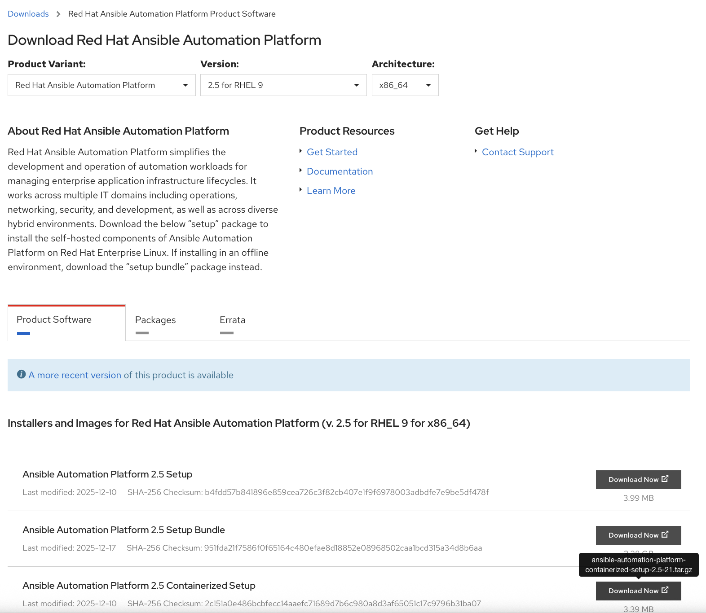

# Demo Packer AAP

## Overview

This repository demonstrates how to build custom machine images using HashiCorp Packer that include Red Hat Ansible Automation Platform (AAP) components. The project automates the creation of pre-configured images with AAP dependencies, making it easier to deploy consistent Ansible environments across your infrastructure.

## What This Repository Does

- **Automated Image Building**: Uses Packer to create machine images with AAP pre-installed and configured
- **Secure Configuration**: Implements secure token handling for accessing private RedHat content
- **Reproducible Builds**: Ensures consistent AAP environments across different deployments

## Prerequisites

### Install packages

```bash
#Ensure latest packer is installed
brew tap hashicorp/tap
brew install hashicorp/tap/packer
#ensure ansible is installed locally for packer provisioner
brew install ansible
```

### Tokens required

Follow [pre-reqs/README.md](./pre-reqs/README.md) to get all the IDs and tokens needed before running the Packer commands.

### Export environment variables

There are 2 methods you can use to handle the environment variables. You can export them as shown below, but you must still create a `.env.local` file in the project root since the [Makefile](./Makefile) requires it when running `make aap_demo`.

```bash
export RHN_USERNAME="glennchia-hashi"
export RHN_PASSWORD="some_password"
export RHSM_ALLOCATION_UUID="7f4075b9-38ac-46e3-986d-bf481d1853be"
export RHSM_OFFLINE_TOKEN="some_offline_token"
export RHN_REGISTRY_SVC="16723312|svc-registry"
export RHN_REGISTRY_TOKEN="ey---------"
export AAP_ADMIN_PASSWORD=Hashi123!
export HUB_OFFLINE_TOKEN="ey..."
```

Or you can set them in a `.env.local` file in the project root with the following. This file is automatically loaded by the Makefile when running targets like `make aap_demo`. This file is also listed in the [.gitignore](./.gitignore).

```ini
# .env.local
RHN_USERNAME="glennchia-hashi"
RHN_PASSWORD="some_password"
RHSM_ALLOCATION_UUID="7f4075b9-38ac-46e3-986d-bf481d1853be"
RHSM_OFFLINE_TOKEN="some_offline_token"
RHN_REGISTRY_SVC="16723312|svc-registry"
RHN_REGISTRY_TOKEN="ey---------"
AAP_ADMIN_PASSWORD=Hashi123!
HUB_OFFLINE_TOKEN="your-access-token-here"
```

### Create ansible.cfg file

An `ansible.cfg` file is required in the root directory for installing supported AAP collections from Red Hat Automation Hub. Replace `<HUB_TOKEN>` below with the value of `HUB_OFFLINE_TOKEN` that is retrieved in the previous step.

> [!NOTE]
> To access private content from Red Hat Automation Hub via `ansible-galaxy`, a token is required. This token is used in `ansible.cfg` but should **never be committed to source control**.

> [!WARNING]
> The `HUB_OFFLINE_TOKEN` expires after 30 days of inactivity. Generate a new token if it has been 30 days or more since your last build.

```
[galaxy]
server_list = hub
ignore_certs = yes

[galaxy_server.hub]
url=https://console.redhat.com/api/automation-hub/content/published/
auth_url=https://sso.redhat.com/auth/realms/redhat-external/protocol/openid-connect/token
token=<HUB_TOKEN>
```

### Set AWS credentials

If you're using doormat, run:

```bash
doormat login -f && eval $(doormat aws export --account ${DOORMAT_AWS_USER})
```

Alternatively set AWS credentials in your environment

```bash
export AWS_ACCESS_KEY_ID=example
export AWS_SECRET_ACCESS_KEY=example
export AWS_SESSION_TOKEN=example
```

## Build AAP image

This repository comes with a [Makefile](./Makefile) that helps with the installs. Run the following to build the AAP base image:

```bash
make aap_demo
```

## Misc

If you intend to build a RHEL9 base image that is configured to trust Vault's CA, run the following. Note that this requires additional environment variables like `VAULT_URL` and `VAULT_NAMESPACE`.

```bash
make rhel9_base
```

## Troubleshooting

Double check the following if your builds are failing

1. The tokens `RHSM_OFFLINE_TOKEN` and `HUB_OFFLINE_TOKEN` expire afer 30 days of inactivity. Ensure that new ones are generated if they are expired.
2. Ensure that the `ansible.cfg` file is created in the root directory and that the `HUB_OFFLINE_TOKEN` matches the value used in the environment variable.

3. If you are getting `Failed to get token` errors with `<urlopen error [Error 111] Connection refused>` this indicates that the ansible containerized setup `tar.gz` could be outdated. Visit https://access.redhat.com/downloads/content/480/ver=2.5/rhel---9/2.5/x86_64/product-software to download the latest `Ansible Automation Platform 2.5 Containerized Setup`. Then change the `aaponlinecontainerizedversion` and `aapfolderpath` variables in [main.yaml](./ansible/roles/aap_containerized/vars/main.yaml) with the up-to-date version. An example of these changes can be found in this [pull request](https://github.com/Hashi-RedHat-APJ-Collab/demo-packer-aap/pull/7).

